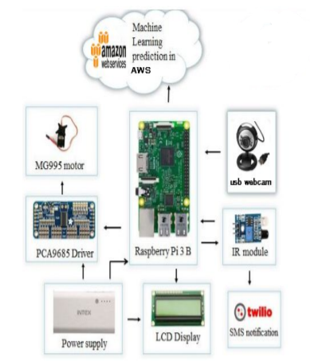
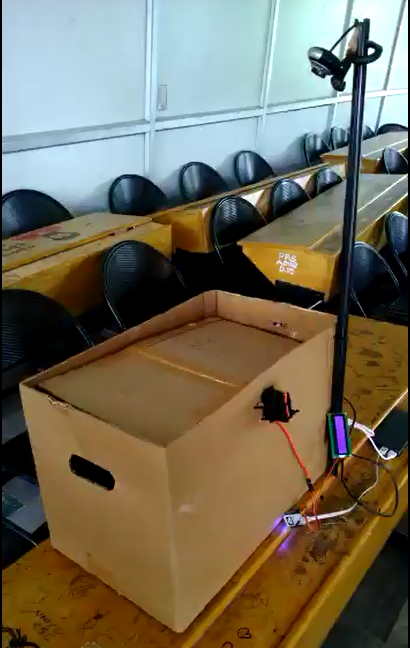

# S-BIN: Smart Garbage Monitoring And Segregation
In today's world, it is important that waste items are treated properly before they are dumped into landfills for decomposition. For efficient decomposition, proper segregation needs to take place. Current waste management practices involve sorting the waste materials in the central facility. If the sorting procedure takes place at the source of garbage production, then their efficiency will increase a lot. However, relying on human beings to segregate their waste items does not work well in the long run as human beings are lazy and become complacent with time. Therefore, an automatic solution is proposed that can perform the task of segregation with great accuracy, without human assistance.

Smart Garbage Monitoring And Segregation is a portable waste segregator system that identifies and separates waste materials into biodegradable and non-biodegradable categories. It uses Machine Learning to identify the type of waste. The entire system is operated using Raspberry Pi 3 developement board. Additional feature of remote monitoring is also implemented. The sys admin can monitor multiple devices and the type of waste processed by them in real-time, using a web application.

<br>

### Donate
<a href="https://www.paypal.me/ajithab"></a>

### System

<table>
	<tr>
		<td>
			
			<h6>&emsp;&emsp;&emsp;&emsp;&emsp;&emsp;&emsp;Interacting subsystems</h6>
		</td>
		<td>
			
			<h6>&emsp;&emsp;&emsp;&emsp;&emsp;&emsp;&emsp;&emsp;&emsp;System</h6>
		</td>
	</tr>
</table>

<br>

### Usage

<h6>Clone the repository.</h6>

```
https://github.com/ajith-ab/S-BIN.git
cd S-BIN

```
<h6>Server side Machine Learning.</h6>

```
python newServer.py
```

This should start the Server side script that listens on port <code>60000</code> for any incoming connections.
<br><br>
<h6>Client side.</h6> 

- Start the client side script on Raspberry Pi as follows -

```
cd client
python client.py
```

The device should takes approx 10 seconds to start up. Place any object on its lid, to see the corresponding results.

<br>

### Demonstration

The working video of the system :<br>

&emsp;&emsp;&emsp;&emsp;&emsp;&emsp;<a href="https://youtu.be/qHEOsNMMazU"></a>\

